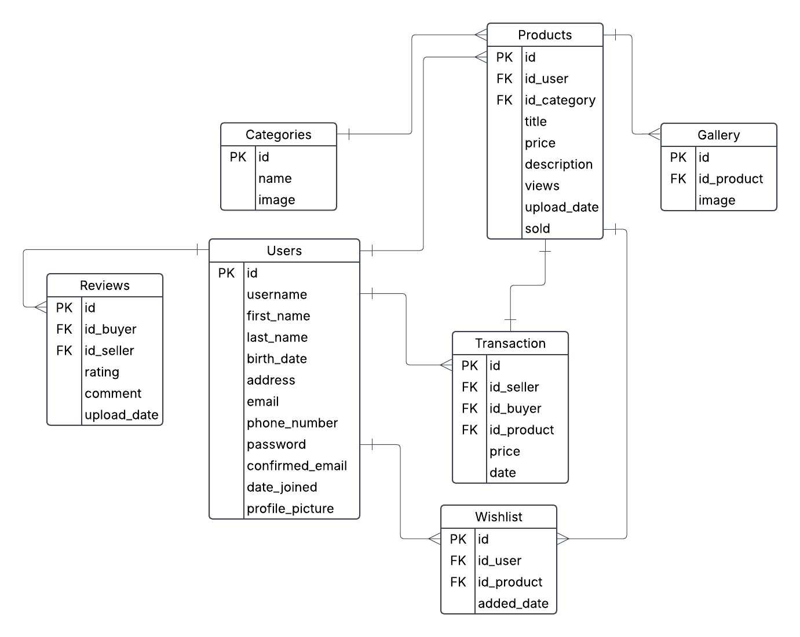

User Stories pentru proiectul de Metode de Dezvoltare Software (Marketplace)

Ca utilizator, vreau să îmi creez un cont, astfel încât să pot cumpăra sau vinde produse pe platformă.

Ca utilizator, vreau să îmi pot reseta parola în cazul în care o uit, astfel încât să nu îmi pierd accesul la cont.

Ca utilizator, vreau să pot căuta produse, astfel încât să găsesc rapid ceea ce mă interesează.

Ca utilizator, vreau să pot filtra produsele după preț și categorie, astfel încât să îmi ușurez căutarea.

Ca vânzător, vreau să pot adăuga un produs cu imagini, descriere și preț, astfel încât să îl listez pe marketplace.

Ca vânzător, vreau să pot edita și șterge produsele mele, astfel încât să pot menține oferta actualizată.

Ca utilizator, vreau să primesc o confirmare prin email după plasarea comenzii, astfel încât să știu că tranzacția a fost înregistrată.

Ca utilizator, vreau să pot lăsa o recenzie vânzătorului în urma unei comenzi, astfel încât să ajut alți utilizatori să ia decizii.

Ca utilizator, vreau să îmi pot edita sau șterge recenzia în cazul în care am făcut o greșeală.

Ca utilizator, vreau să pot adăuga produse la wishlist pentru a fi informat cand prețul acestora scade.

Ca administrator, vreau să pot șterge review-urile și produsele care încalcă ToS-ul (Terms of Service).

Ca utilizator, aș dori ca site-ul sa fie responsive.

ERD pentru baza de date

Am folosit si tool de AI in timpul dezvoltarii software
https://chatgpt.com/share/684ef6ba-6f58-8004-818c-a3eb45827f52
